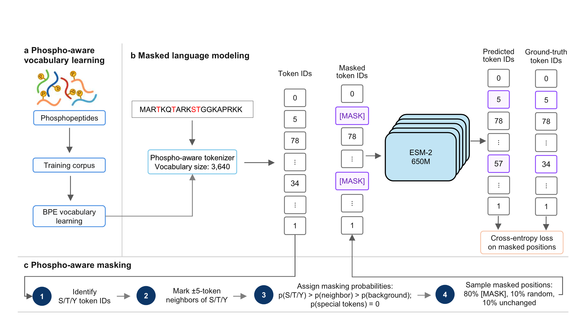

# PhosphoLM: phospho-aware protein language model

PhosphoLM combines a phospho-aware tokenizer with masked language modeling to learn protein representations for phosphorylation-related tasks. It supports phosphosite and functional-phosphosite prediction, disease association, druggability and phosphorylation-dependent protein–protein interaction prediction.



## 1. Setup

Use Linux and Conda. Training requires a suitable NVIDIA GPU; token training and MLM pretraining use BF16, and MLM also uses FlashAttention.

```bash
git clone https://github.com/HanyangBISLab/PhosphoLM.git
cd PhosphoLM
conda env create -n ptm_language -f environment.yml
conda activate ptm_language
```

Run all commands below from the `PhosphoLM` folder. ESM-2 weights are downloaded from Hugging Face on first use.

## 2. Files you need

Download the project data and pretrained model: **[PhosphoLM.zip (Google Drive)](https://drive.google.com/file/d/15ydKegyDKyzuO8fjJZ1RmCYmtgdHnKN7/view?usp=sharing)**.

Extract the ZIP and merge the contents of its `PhosphoLM/` folder into your cloned repository, keeping the folder structure below.

The archive includes datasets, analysis results, figures and the pretrained PhosphoLM checkpoint. Use the training and inference commands below to generate downstream checkpoints and predictions. For MLM pretraining, also provide the UniRef50 FASTA file.

```text
PhosphoLM/
├── datasets/       # Data, cross-validation folds and cached embeddings
├── models/         # Pretrained model and downstream checkpoints
├── output/         # Predictions and pretraining outputs
├── analysis/       # Selected tokens and distance results
├── figures/        # Generated figures
├── phospholm/      # Shared Python code
└── *.py            # Scripts to run
```

The pretrained model and tokenizer belong in `models/pretrained_phosphoLM/`. Keep the supplied fold files under `datasets/<task>/folds/`; phosphosite prediction uses `datasets/dbptm/folds/`.

Use the supplied caches under `datasets/ppi/embeddings/<model>/` for PPI training, and the corresponding embedding caches for PTM-Mamba disease and druggability.

## 3. Recreate the comparison figures

With saved predictions under `output/`, run:

```bash
python plot_comparision.py
```

This creates ROC curves, precision–recall curves and metric bar plots at 90% and 95% specificity for all five tasks under `figures/`. All three models' fold predictions are required.

To plot one task:

```bash
python plot_comparision.py --tasks phosphorylation
```

Other task names are `functional`, `disease`, `druggable` and `ppi`.

## 4. Run PhosphoLM experiments

### Train

```bash
python phosphoLM_phosphosite_kfold_training.py
python phosphoLM_funcphos_kfold_training.py
python phosphoLM_disease_kfold_training.py
python phosphoLM_druggable_kfold_training.py
python phosphoLM_ppi_kfold_training.py
```

Phosphosite prediction runs 10 folds; the other tasks run 5 folds. Checkpoints are saved under `models/phosphoLM_<task>/`. Disease and druggability training generate missing embeddings automatically. Disease, druggability and PPI training also save test predictions.

### Predict using trained checkpoints

```bash
python phosphoLM_phosphosite_inference.py
python phosphoLM_funcphos_inference.py
python phosphoLM_disease_inference.py
python phosphoLM_druggable_inference.py
python phosphoLM_ppi_inference.py
```

Predictions are saved under `output/<task>/phosphoLM/predictions/`. Disease, druggability and PPI inference require cached test embeddings. Run `python plot_comparision.py` after all model predictions are available.

Downstream training uses focal loss with alpha = 0.85, gamma = 2.5 and an initial or peak learning rate of `1e-4`.

### Baselines

For ESM-2 650M, replace `phosphoLM_` with `esm2_650M_` in the commands above. Generate its PPI embeddings before PPI training if they are missing:

```bash
python esm2_650M_ppi_save_embeddings.py
```

For PTM-Mamba-specific setup and workflows, follow the [PTM-Mamba repository](https://github.com/programmablebio/ptm-mamba). Use this project's `ptm_mamba_` scripts for `disease`, `druggable` and `ppi`. For phosphosite and functional-phosphosite comparisons, provide externally generated PTM-Mamba fold predictions.

## 5. Run the token and distance analyses

Select phosphosite-associated tokens:

```bash
python phosphosite_proximal_token_analysis.py
```

Calculate structural distances in a separate PyMOL environment:

```bash
conda create -n phospholm_pymol -c conda-forge python=3.11 pymol-open-source numpy requests
conda run -n phospholm_pymol python calculate_phosphosite_token_distances.py
```

The structural script reads `datasets/pdb/SEP_TPO_PTR_PDBs.json`, downloads missing structures and reuses existing per-structure results.

Plot structural distances and then sequence distances:

```bash
python plot_phosphosite_token_distance_heatmap.py
python plot_phosphosite_sequence_distance_heatmap.py
```

The structural plot needs `datasets/pfam/pdb_pfam_mapping.txt`. Tables go into `analysis/` and plots into `figures/`. If the selected tokens and structural results are already available, run only the two plotting commands.

## 6. Optional: tokenizer, pretraining and embedding export

To train from the beginning, provide `datasets/phosphopeptides/phosphopeptides.txt` and `datasets/uniref50/uniref50.fasta`, then run:

```bash
python tokenizer_training.py
accelerate launch mlm_training.py
```

The tokenizer is saved to `output/phospholm_tokenizer/` and the final pretrained model to `output/mlm_pretraining/final_model/`. Pretraining resumes the latest saved checkpoint automatically. To use a newly trained model downstream, place its model and tokenizer files in `models/pretrained_phosphoLM/`.

Export phosphosite embeddings for PhosphoLM and ESM-2:

```bash
python phosphosite_save_embeddings.py --model both
```

To rebuild PhosphoLM PPI partner embeddings while keeping the supplied site embeddings:

```bash
python phosphoLM_ppi_save_embeddings.py --embedding-root datasets/ppi/embeddings/phosphoLM_recomputed
```

Pass `--embedding-root datasets/ppi/embeddings/phosphoLM_recomputed` to the PhosphoLM PPI training and inference scripts to use this cache.

---

This README was drafted by GPT-6 Astra with AI assistance.
